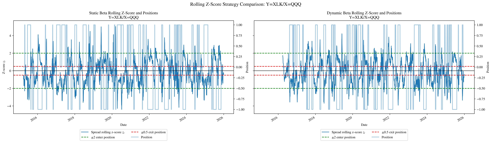
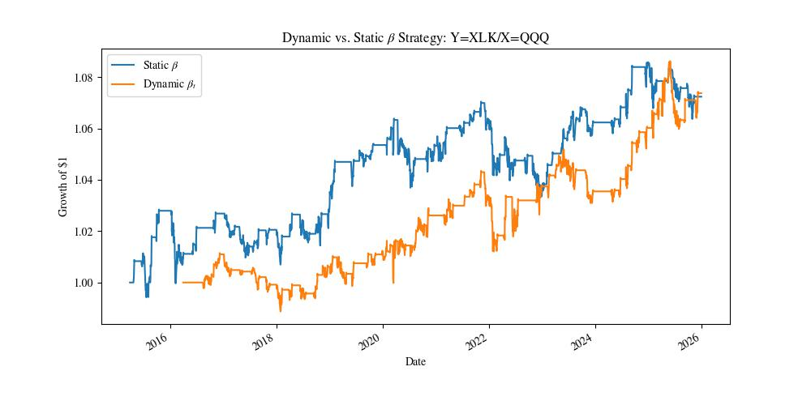
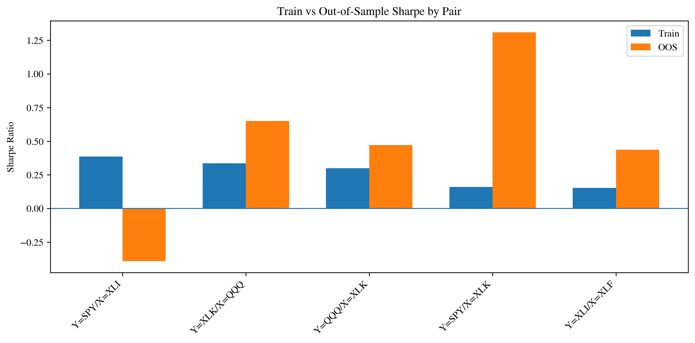
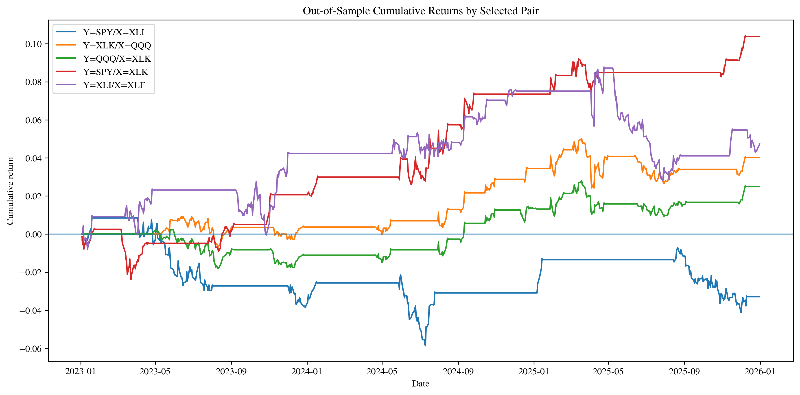

# ETF Pairs Trading Backtest

This project implements and evaluates a pairs-trading strategy on a universe of liquid U.S. ETFs. The strategy searches for related ETF pairs, constructs a rolling regression spread, trades deviations from the spread's recent mean, and evaluates performance using transaction costs, parameter sensitivity, fixed train/test validation, mean-reversion diagnostics, and walk-forward validation.

The goal is not to build a production trading system, but to study whether a simple statistical arbitrage framework can produce stable out-of-sample results when applied carefully.

## Project Overview

Pairs trading is a market-neutral strategy based on the idea that two related assets may temporarily diverge from their usual relationship and later converge. In this project, I apply that idea to ETF pairs.

For each candidate pair, I estimate a rolling hedge ratio using price-level OLS regression:

$$Y_t = \alpha_t + \beta_t X_t + \varepsilon_t.$$

The residual spread is then:

$$S_t = Y_t - \alpha_t - \beta_t X_t.$$

A rolling z-score is computed from the spread:

$$z_t = \frac{S_t - \bar{S}_{w}}{\sigma_w}.$$

Where $w$ denotes the window. The strategy enters trades when the spread is far from its recent mean and exits when the spread reverts close to normal levels.

## Data

The project uses daily adjusted close prices downloaded with `yfinance`.

The ETF universe includes broad market, sector, bond, and commodity ETFs:

```python
[
    "SPY", "QQQ", "IWM",
    "XLK", "XLF", "XLE", "XLV",
    "XLY", "XLP", "XLI", "XLU",
    "TLT", "HYG", "LQD", "GLD",
]
```

The main sample period is:

```text
2015-01-01 to 2026-01-01
```

## Strategy Methodology

The strategy pipeline is:

1. Download and clean ETF price data.
2. Compute daily returns.
3. Rank candidate pairs by training-period return correlation.
4. Estimate a rolling hedge ratio using price-level OLS.
5. Construct the rolling spread.
6. Compute a rolling z-score of the spread.
7. Enter long-spread or short-spread positions based on z-score thresholds.
8. Exit when the spread reverts close to its mean.
9. Apply transaction costs.
10. Evaluate performance using out-of-sample validation.

The baseline trading rules are:

```text
Entry threshold: ±2.0
Exit threshold:  ±0.5
Hedge window:    252 trading days
Z-score window:  120 trading days
Transaction cost: 5 basis points
```

A long-spread position means long $Y$ and short $\beta_t X$.
A short-spread position means short $Y$ and long $\beta_t X$.

## Repository Structure

```text
pairs-trading-backtest/
│
├── data/
│   └── raw/                         # Cached price data
│
├── notebooks/
│   ├── 01_data_exploration.ipynb
│   ├── 02_single_pair_strategy.ipynb
│   ├── 03_parameter_sensitivity.ipynb
│   ├── 04_out_of_sample_validation.ipynb
│   ├── 05_mean_reversion_diagnostics.ipynb
│   ├── 06_half_life_exit_validation.ipynb
│   └── 07_walk_forward_validation.ipynb
│
├── src/
│   ├── __init__.py
│   ├── data.py
│   └── pairs_trading.py
│
├── requirements.txt
└── README.md
```

## Notebooks

### 01 Data Exploration

Loads ETF price data, computes daily returns, and ranks ETF pairs by return correlation.

### 02 Single Pair Strategy

Builds the pairs-trading strategy for one ETF pair. This notebook introduces the hedge ratio, spread, z-score, position rules, strategy returns, trade log, and performance metrics. We go from full sample statistics to rolling z-score with a fixed hedge ratio to rolling z-score with a dynamic hedge ratio.

### 03 Sensitivity Analysis

Tests how the strategy changes under different model parameters, such as z-score windows and entry thresholds.

### 04 Out-of-Sample Validation

Evaluates selected pairs using a fixed train/test split. Candidate pairs are selected using training-period information only, then evaluated out of sample.

### 05 Mean-Reversion Diagnostics

Tests whether selected spreads show statistical evidence of mean reversion. Diagnostics include:

* Augmented Dickey-Fuller test
* Engle-Granger cointegration test
* OU half-life estimate
* Hurst exponent estimate

The results show that selected spreads generally have evidence of mean reversion, but mean-reversion diagnostics alone do not perfectly predict out-of-sample profitability.

### 06 Half-Life Exit Validation

Tests whether an OU half-life-based maximum holding period improves performance.

The half-life exit rule did not materially change the results. The original z-score exit rule already closed most trades well before the half-life-based maximum holding period became binding.

This suggests that the OU half-life is more useful as a diagnostic than as an active exit rule in this version of the strategy.

### 07 Walk-Forward Validation

Evaluates the strategy using expanding-window walk-forward validation.

Each fold selects pairs using only past data, then evaluates the selected pairs over the next calendar year.

The walk-forward results show positive average Sharpe in six out of seven test years, with 2020 as the main failure case. This suggests that the strategy has some out-of-sample structure, but the edge is modest and regime-dependent.

## Results

### Dynamic vs. Static Hedge Ratio $\beta$

I developed the strategy first using the full data set, then progressively eliminated look-ahead bias by implementing rolling computations. Below is a comparison of the strategy with a fixed hedge ratio $\beta$ versus with a dynamic hedge ratio $\beta_t$.





| Strategy | Total Return | Annualized Return | Annualized Volatility | Sharpe Ratio | Max Drawdown |
|---|---:|---:|---:|---:|---:|
| Static-beta $\beta$ rolling z-score | 7.25% | 0.65% | 1.98% | 0.3388 | -3.47% |
| Dynamic-beta $\beta_t$ rolling z-score | 7.38% | 0.73% | 1.92% | 0.3910 | -3.01% |

The dynamic-beta rolling z-score strategy slightly outperforms the static-beta version. It has a higher total return, higher Sharpe ratio, lower annualized volatility, and smaller maximum drawdown. However, the improvement is modest, suggesting that allowing the hedge ratio to vary through time helps, but does not dramatically change the strategy's performance.

### Out-of-Sample Validation
Training period:
```text
2015-01-01 to 2022-12-31
```
Used to select for pairs, direction, and strategy settings.

Testing period:
```text
2023-01-01 to 2026-01-01
```
Period to trade selected pairs and to keep updating beta and z-score using rolling historical windows. Below is the out-of-sample versus training period results.

| Pair        | Train Correlation | Train Total Return | OOS Total Return | Train Sharpe | OOS Sharpe | Sharpe Change | Train Trades | OOS Trades |
| ----------- | ----------------: | -----------------: | ---------------: | -----------: | ---------: | ------------: | -----------: | ---------: |
| Y=SPY/X=XLK |            0.9381 |              2.79% |           10.38% |       0.1596 |     1.3097 |        1.1501 |           21 |         13 |
| Y=XLK/X=QQQ |            0.9777 |              3.90% |            4.02% |       0.3351 |     0.6500 |        0.3149 |           25 |         12 |
| Y=QQQ/X=XLK |            0.9777 |              3.46% |            2.50% |       0.2986 |     0.4711 |        0.1725 |           24 |         11 |
| Y=XLI/X=XLF |            0.8855 |              3.05% |            4.73% |       0.1526 |     0.4373 |        0.2847 |           20 |         11 |
| Y=SPY/X=XLI |            0.8996 |              8.25% |           -3.29% |       0.3853 |    -0.3915 |       -0.7768 |           26 |          6 |





## Key Findings

The project produced several important findings.

First, the basic rolling z-score pairs strategy can generate positive out-of-sample results for some ETF pairs, especially technology-related pairs such as `XLK/QQQ` and `SPY/XLK`.

Second, pair selection is fragile. Strong training-period Sharpe does not always generalize out of sample. Some pairs with strong in-sample performance perform poorly in later periods.

Third, the mean-reversion diagnostics support the basic modeling assumption, but they are not sufficient trading signals by themselves. Several spreads pass ADF or Hurst-based diagnostics, but not all of them produce strong out-of-sample performance.

Fourth, the half-life-based exit rule does not materially improve the strategy. The original z-score exit rule usually closes trades before the half-life constraint becomes relevant.

Finally, walk-forward validation gives a more realistic view of performance. The strategy is positive in most folds, but the average performance is modest and the 2020 fold shows that the strategy can break down during stressed and volatile time periods.

## Limitations

This is a research backtest, not a production trading system.

Important limitations include:

* The ETF universe is small.
* The strategy uses daily close prices only.
* Transaction costs are simplified.
* The backtest does not model bid-ask spreads or market impact.
* Pair selection is based mainly on correlation and training Sharpe.
* The strategy can be regime-dependent.
* The walk-forward results are positive but modest.
* The project does not include portfolio optimization or risk targeting.

## Possible Extensions

Natural extensions include:

1. Testing other ETF universes, such as international ETFs, commodity ETFs, bond ETFs, or factor ETFs.
2. Testing single-name equity pairs within sectors.
3. Adding stricter stationarity or cointegration filters.
4. Comparing ETF pairs across different market regimes.
5. Building an equal-weight portfolio of selected pair strategies.
6. Adding more realistic transaction cost and slippage assumptions.
7. Testing whether pair-selection rules improve when combining training Sharpe with mean-reversion diagnostics.

The most natural next step would be to test the same framework on other asset universes and compare whether the results are stronger or weaker than the U.S. ETF universe.

## How to Run

Create and activate a Python environment, then install the required packages:

```bash
pip install -r requirements.txt
```

Then run the notebooks in order:

```text
01_data_exploration.ipynb
02_single_pair_strategy.ipynb
03_parameter_sensitivity.ipynb
04_out_of_sample_validation.ipynb
05_mean_reversion_diagnostics.ipynb
06_half_life_exit_validation.ipynb
07_walk_forward_validation.ipynb
```

The data-loading function caches downloaded ETF prices locally in `data/raw/`, so repeated notebook runs do not need to redownload the same data.

## Disclaimer

This project is for educational and research purposes only. It is not financial advice and should not be interpreted as a recommendation to trade any security or strategy.
